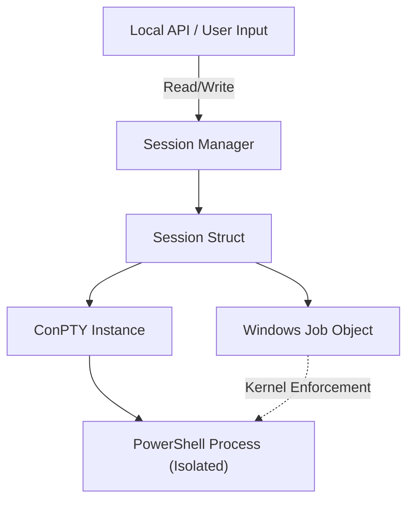

# Windows Agent: High-Level Architecture

The ZeroExec Windows Agent is a high-performance, secure component designed to manage native terminal sessions using Windows-specific APIs.

## 🏗️ Core Components

### 1. ConPTY (Pseudo Console) Integration
Instead of faking terminal behavior, the agent utilizes the **Windows Pseudo Console (ConPTY)** API (`CreatePseudoConsole`).
- **Data Flow**: `stdin → PTY Input Pipe → ConPTY → Shell (PowerShell) → ConPTY → PTY Output Pipe → stdout`.
- **Emulation**: Handles VT sequences, cursor positioning, and complex interactive programs natively.

### 2. Windows Job Objects (Isolation)
To prevent orphaned processes and ensure a clean security boundary, every shell process is assigned to a unique **Windows Job Object**.
- **Limit Flags**: `JOB_OBJECT_LIMIT_KILL_ON_JOB_CLOSE` ensures that if the agent or the session crashes, the entire process tree (shell + children) is instantly terminated by the kernel.
- **Resource Control**: Provides a foundation for future CPU/Memory limits.

### 3. Session Manager
A thread-safe registry that manages the lifecycle of [Session](file:///c:/Users/BIT/ZeroExec/backend/session_manager.go#11-17) structs.
- **State**: Tracks PTY handles, Job Object handles, and process IDs.
- **Cleanup**: Ensures all Windows handles are closed and processes are reaped on session termination.

### 4. Structured Audit Logger
Records all terminal interactions with metadata: `session_id`, `timestamp`, `direction (IN/OUT)`, and the raw `data`.

## 🔄 System Flow Diagram

## 🔐 Security Model
- **Process Isolation**: Job Objects ensure zero orphaned processes.
- **Local Access**: Designed for local integration (Phase 1) with future-proofed streaming pipes.
- **Least Privilege**: Runs in user context without requiring elevation.
