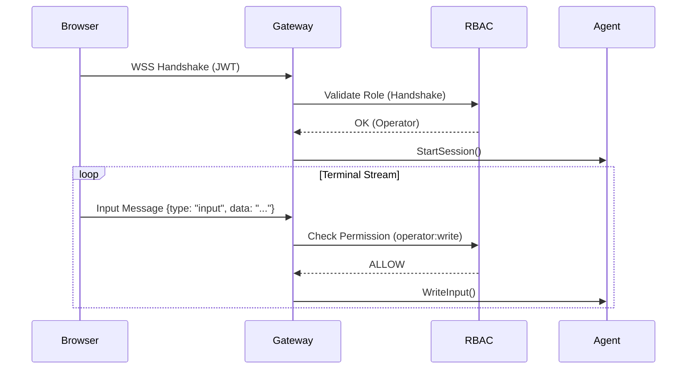

# ZeroExec: Enterprise Security & RBAC Architecture

This document outlines the zero-trust security model implemented in Phase 3, transforming ZeroExec into a hardened, multi-user remote execution platform.

## 🛡️ Security Layers

### 1. Identity Layer (Auth)
- **Hardened JWTs**: Tokens are short-lived (15 mins) and contain `user_id`, `role`, and `version`.
- **Memory-Bound**: Tokens are never stored in `localStorage` by the client, neutralizing XSS-based token theft.

### 2. Authorization Layer (RBAC)
We enforce a strict Role-Based Access Control model:
- **Viewer**: Read-only access. Can see terminal output but all input messages are rejected.
- **Operator**: Standard interactive access. Can run commands and interact with the shell.
- **Admin**: Governance access. Can list all active sessions and terminate any session via the Admin API.

### 3. Session Controller
- **Idle Timeout**: Automatically terminates sessions after 10 minutes of inactivity.
- **Max Duration**: Hard limit of 1 hour per session to prevent long-running resource abuse.
- **Heartbeat**: Uses WebSocket Ping/Pong to detect silent disconnections and clean up immediately.

### 4. Traffic Hardening
- **Rate Limiting**: Bounded at 20 messages/second per connection to prevent flood attacks.
- **Input Validation**: Strict JSON schema enforcement and payload size limits (max 8KB per message).

## 🔄 RBAC Enforcement Flow

## 🔐 Failure Multi-Layer Guarantee
- **Socket Drop**: Graceful cleanup of goroutines.
- **Timeout**: Agent session stopped, Job Object kills processes.
- **Gateway Crash**: Job Object (Windows) kills all child processes instantly (fail-safe).
